# Arquitectura - Kairos

<!--
Copyright 2026 © The Kairos Authors
SPDX-License-Identifier: Apache-2.0
-->

## Visión general

Kairos es un **framework de agentes IA nativo en Go** diseñado para entornos
de producción. Combina bucles ReAct emergentes, planificadores declarativos,
protocolos de interoperabilidad (MCP, A2A), observabilidad nativa (OpenTelemetry)
y gobernanza integrada bajo una única API coherente.

## Arquitectura por capas

El framework se organiza en 6 capas, desde la interfaz de usuario hasta el
almacenamiento:

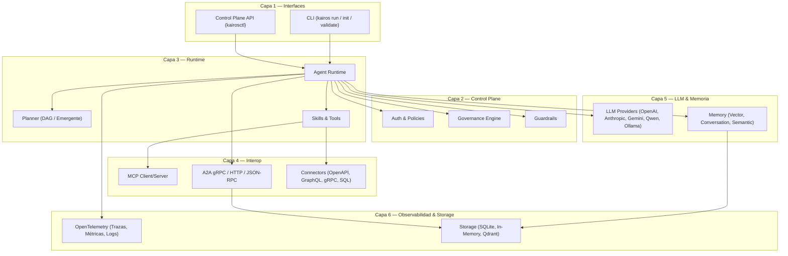

## Diagrama C4 — Contexto del sistema

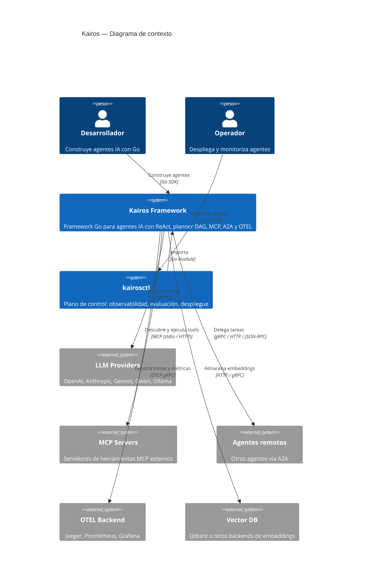

## Diagrama C4 — Contenedores

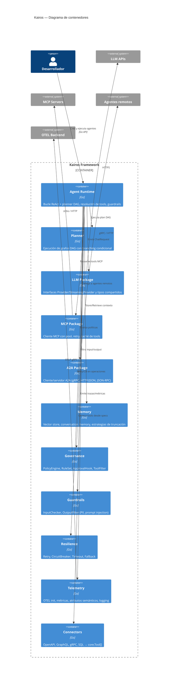

## Interfaces core

Las interfaces principales definen el contrato entre componentes:

```go
// Agent define la interfaz de un agente ejecutable.
type Agent interface {
    ID() string
    Role() string
    Skills() []Skill
    Memory() Memory
    Run(ctx context.Context, input any) (any, error)
}

// Tool define una herramienta invocable por el agente.
type Tool interface {
    Name() string
    Call(ctx context.Context, input any) (any, error)
    ToolDefinition() llm.Tool
}

// Memory define almacenamiento de contexto.
type Memory interface {
    Store(ctx context.Context, data any) error
    Retrieve(ctx context.Context, query any) (any, error)
}

// Provider define la interfaz para backends LLM.
type Provider interface {
    Chat(ctx context.Context, req ChatRequest) (*ChatResponse, error)
}

// StreamingProvider extiende Provider con streaming.
type StreamingProvider interface {
    Provider
    ChatStream(ctx context.Context, req ChatRequest) (<-chan StreamChunk, error)
}
```

## Flujo del Agent Loop (ReAct)

El bucle ReAct es el mecanismo principal de ejecución emergente:

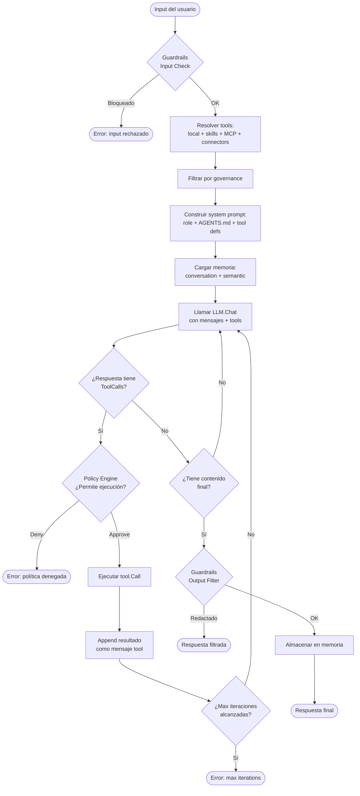

## Flujo del Planner (DAG explícito)

Cuando se configura un grafo explícito con `agent.WithPlanner(graph)`, el
agente ejecuta un DAG en lugar del bucle ReAct:

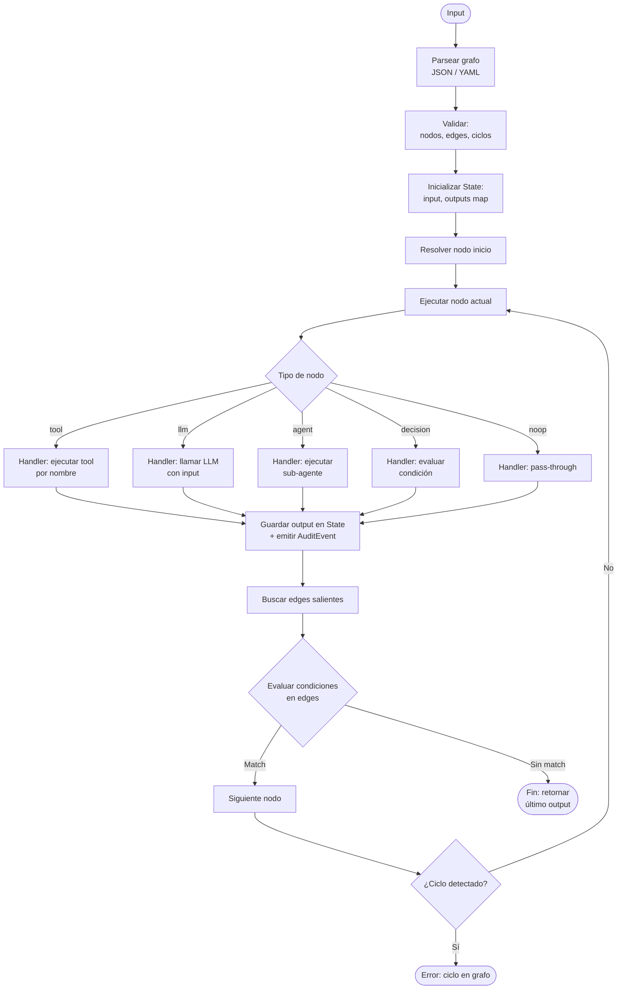

### Condiciones soportadas en edges

| Patrón | Descripción |
|--------|-------------|
| `last==valor` | Último output igual a valor |
| `last!=valor` | Último output distinto de valor |
| `last.contains:texto` | Último output contiene texto |
| `output.nodeID==valor` | Output de nodo específico igual a valor |
| (vacío) | Edge por defecto (siempre se toma) |

## Interoperabilidad: MCP

El protocolo MCP permite descubrir y ejecutar herramientas externas:

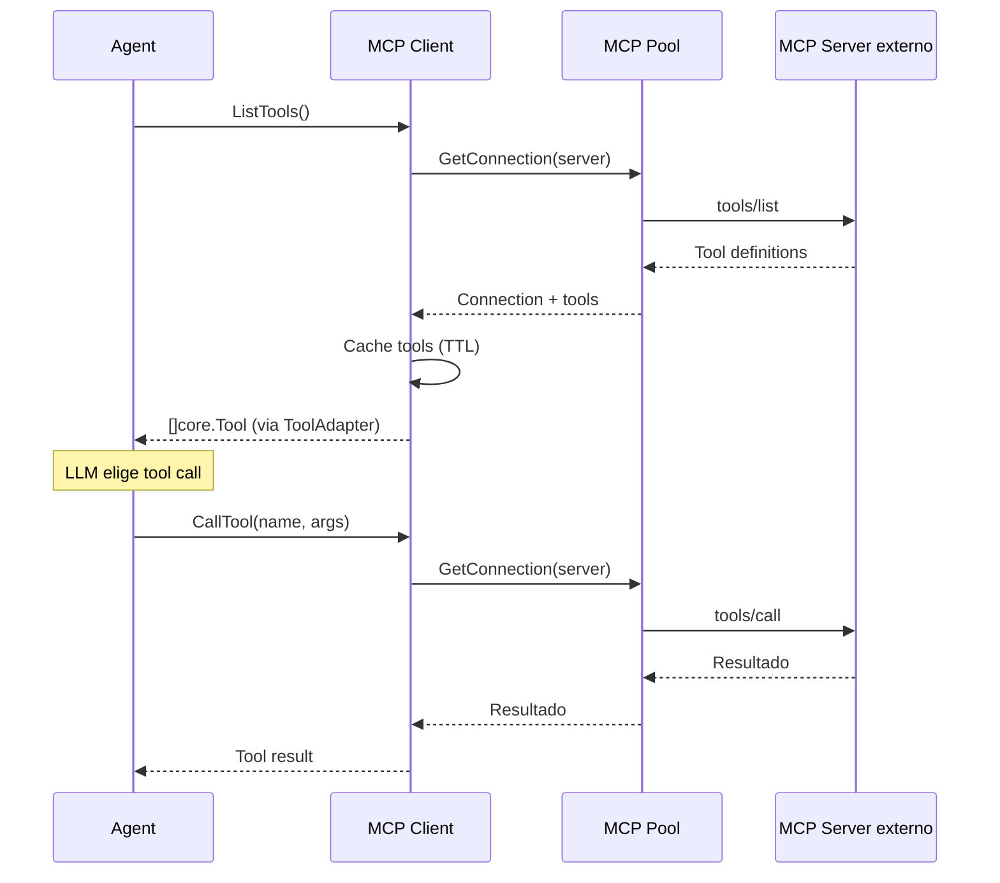

### Componentes MCP

| Componente | Paquete | Descripción |
|------------|---------|-------------|
| `Client` | `pkg/mcp` | Cliente MCP (Stdio + StreamableHTTP), retry exponencial, caché de tools |
| `Server` | `pkg/mcp` | Servidor MCP con `RegisterTool()`, sirve via Stdio o HTTP |
| `ToolAdapter` | `pkg/mcp` | Implementa `core.Tool` envolviendo herramientas MCP |
| `Pool` | `pkg/mcp/pool` | Pool de conexiones con reference counting, health check, idle cleanup |

## Interoperabilidad: A2A (Agent-to-Agent)

El protocolo A2A permite arquitecturas distribuidas entre agentes:

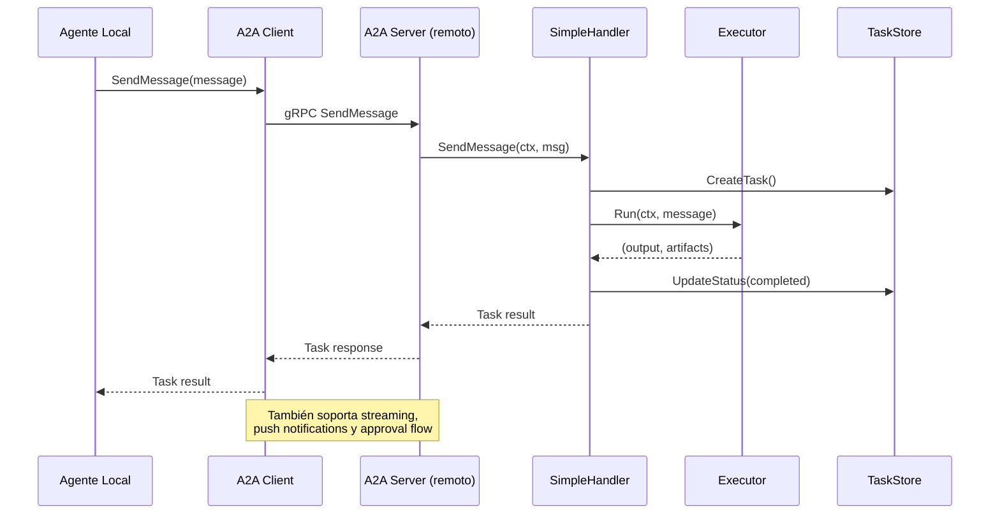

### Transportes A2A

| Transporte | Paquete | Protocolo |
|------------|---------|-----------|
| gRPC | `pkg/a2a/server`, `pkg/a2a/client` | Protobuf + streaming bidireccional |
| HTTP/JSON | `pkg/a2a/httpjson` | REST + SSE para streaming |
| JSON-RPC | `pkg/a2a/jsonrpc` | JSON-RPC 2.0 + SSE |

### Backends de almacenamiento A2A

| Store | Implementación | Descripción |
|-------|---------------|-------------|
| `MemoryTaskStore` | In-memory | Por defecto, para desarrollo |
| `SQLiteTaskStore` | SQLite (sin CGO) | Producción, via `modernc.org/sqlite` |
| `MemoryPushConfigStore` | In-memory | Push notifications (dev) |
| `SQLitePushConfigStore` | SQLite | Push notifications (prod) |

## LLM Providers

El sistema de providers sigue una arquitectura pluggable:

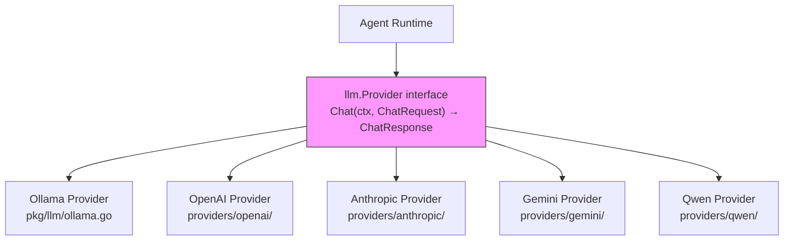

Cada provider traduce entre los tipos genéricos (`ChatRequest`/`ChatResponse`)
y el formato nativo del LLM. Todos soportan `StreamingProvider` para
respuestas en tiempo real.

### Tipos compartidos (`pkg/llm/provider.go`)

| Tipo | Descripción |
|------|-------------|
| `ChatRequest` | Modelo, mensajes, tools, temperatura |
| `ChatResponse` | Contenido, tool_calls, usage |
| `Tool` | Definición de función (type + function) |
| `ToolCall` | Llamada a tool del LLM (id, type, function) |
| `Message` | Role, content, tool_calls, tool_call_id |
| `StreamChunk` | Delta de contenido para streaming |

## Conectores (Tools)

Los conectores generan `[]core.Tool` desde especificaciones externas:

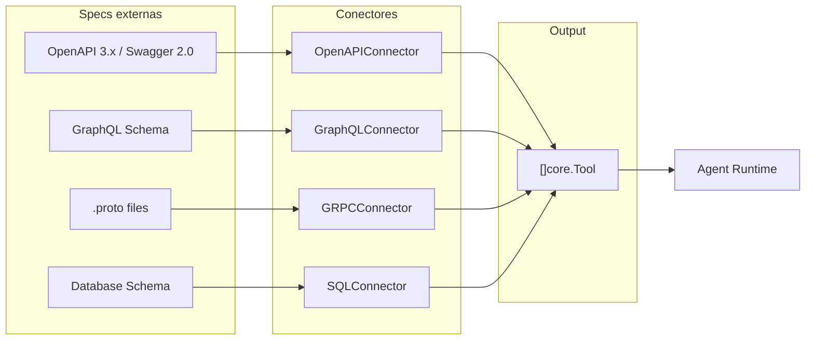

### Conectores disponibles

| Conector | Spec de entrada | Estado |
|----------|-----------------|--------|
| `OpenAPIConnector` | OpenAPI 3.x, Swagger 2.0 | Implementado |
| `MCPConnector` | MCP protocol | Implementado |
| `GraphQLConnector` | Schema introspection | Implementado |
| `GRPCConnector` | `.proto` files | Implementado |
| `SQLConnector` | Database schema | Implementado |

## Memoria

El sistema de memoria tiene dos dimensiones: **semántica** (vector) y
**conversacional** (historial):

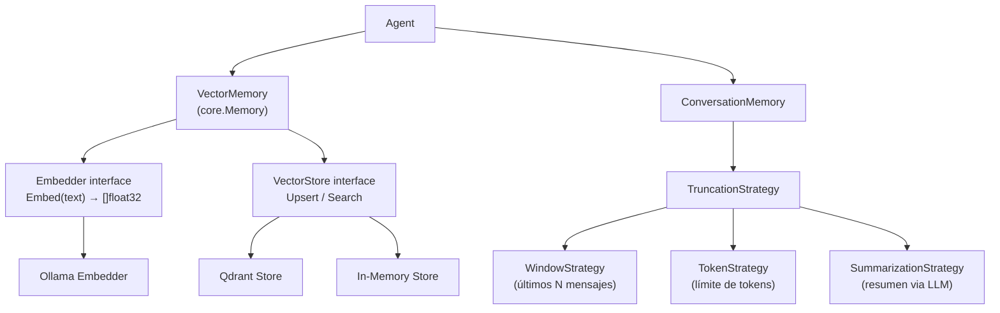

## Gobernanza y guardrails

### Governance

El `PolicyEngine` evalúa cada acción antes de ejecutarla:

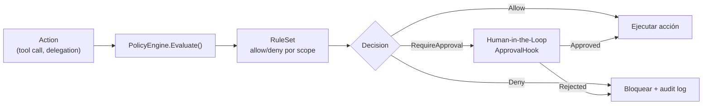

### Guardrails

Filtros de seguridad en input y output:

| Tipo | Interface | Función |
|------|-----------|---------|
| Input | `InputChecker` | Detecta prompt injection, contenido peligroso |
| Output | `OutputFilter` | Redacta PII, contenido sensible |

## Resiliencia

Patrones de resiliencia integrados en el framework:

| Patrón | Tipo | Descripción |
|--------|------|-------------|
| Retry | `RetryConfig` | Exponential backoff con jitter, `IsRecoverable` check |
| Circuit Breaker | `CircuitBreaker` | Closed → Open → HalfOpen, umbrales configurables |
| Timeout | `TimeoutConfig` | Goroutine-based timeout con `CodeTimeout` error |
| Fallback | `FallbackStrategy` | Static, Cached, Chained, `GracefulDegradation` |

## Observabilidad

### Instrumentación OTEL

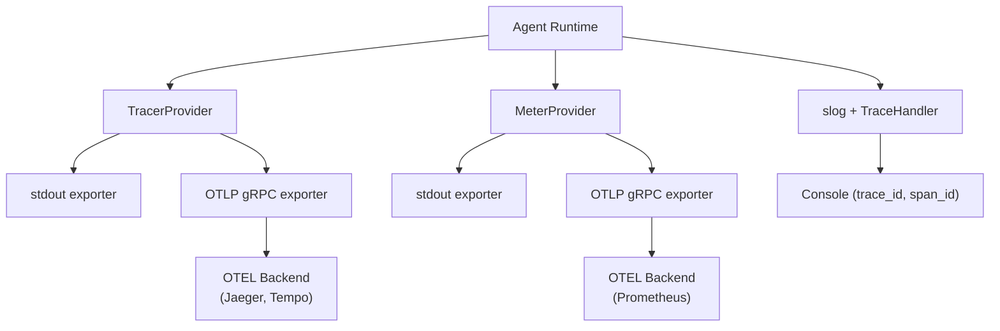

### Métricas del agente

| Métrica | Tipo | Descripción |
|---------|------|-------------|
| `kairos.agent.run.count` | Counter | Ejecuciones totales del agente |
| `kairos.agent.error.count` | Counter | Errores totales |
| `kairos.agent.run.latency_ms` | Histogram | Latencia por ejecución |
| `kairos.agent.llm.latency_ms` | Histogram | Latencia de llamadas LLM |
| `kairos.agent.tool.latency_ms` | Histogram | Latencia de tool calls |
| `kairos.agent.memory.latency_ms` | Histogram | Latencia de operaciones de memoria |

### Métricas de errores y salud

| Métrica | Tipo | Descripción |
|---------|------|-------------|
| `kairos.errors.total` | Counter | Errores por código y severidad |
| `kairos.errors.recovered` | Counter | Errores recuperados |
| `kairos.errors.rate` | Gauge | Tasa de errores |
| `kairos.health.status` | Gauge | Estado de salud (0=down, 1=degraded, 2=healthy) |
| `kairos.circuitbreaker.state` | Gauge | Estado del circuit breaker |

### Configuración de telemetría

```json
{
  "telemetry": {
    "exporter": "otlp",
    "otlp_endpoint": "localhost:4317",
    "otlp_insecure": true
  }
}
```

Variables de entorno: `KAIROS_TELEMETRY_EXPORTER`, `KAIROS_TELEMETRY_OTLP_ENDPOINT`,
`KAIROS_TELEMETRY_OTLP_INSECURE`, `KAIROS_TELEMETRY_OTLP_TIMEOUT_SECONDS`.

## Configuración

Fuentes de configuración con precedencia creciente:

1. **Valores por defecto** (hardcoded)
2. **Archivo** (`~/.kairos/settings.json` o `./.kairos/settings.json`)
3. **Variables de entorno** (`KAIROS_*`)
4. **CLI flags** (`--config=...`, `--set key=value`)

Ver [CONFIGURATION.md](CONFIGURATION.md) para la guía completa.

## Layout de paquetes

```
pkg/
├── agent/          # Agent runtime (ReAct + planner integration)
├── a2a/            # A2A protocol (client, server, types, agentcard)
│   ├── client/
│   ├── server/
│   ├── httpjson/
│   ├── jsonrpc/
│   ├── agentcard/
│   └── types/
├── config/         # Configuration types
├── connectors/     # External API connectors (OpenAPI, GraphQL, gRPC, SQL)
├── core/           # Shared interfaces (Agent, Tool, Memory, Event, Health)
├── discovery/      # Agent/service discovery
├── errors/         # Typed errors (KairosError, ErrorCode)
├── governance/     # Policy engine, rules, approval hooks
├── guardrails/     # Input/output security filters
├── llm/            # LLM provider interface + Ollama implementation
├── mcp/            # MCP client/server + tool adapter
│   └── pool/       # Connection pooling
├── memory/         # Vector + conversation memory
│   ├── ollama/     # Ollama embedder
│   └── qdrant/     # Qdrant vector store
├── planner/        # Graph-based DAG planner
├── resilience/     # Retry, circuit breaker, timeout, fallback
├── runtime/        # Runtime orchestration
├── skills/         # AgentSkills spec loader
├── telemetry/      # OpenTelemetry setup + metrics + logging
└── testing/        # Test helpers, scenarios, mock provider

providers/
├── openai/         # OpenAI provider (GPT-4, GPT-5)
├── anthropic/      # Anthropic provider (Claude)
├── gemini/         # Google Gemini provider
└── qwen/           # Alibaba Qwen provider (DashScope)

examples/
├── 01-hello-agent/ ... 20-conversation-memory/
├── playbook/       # Narrativa completa multi-agente
└── mcp-http-server/
```

## Enlaces relacionados

- [API Reference](API.md)
- [Planner conceptos](Conceptos_Planner.md)
- [MCP Protocol](protocols/MCP.md)
- [A2A Protocol](protocols/A2A/Overview.md)
- [Error Handling](ERROR_HANDLING.md)
- [Observability](OBSERVABILITY.md)
- [Governance](governance-usage.md)
- [Guardrails](GUARDRAILS.md)
- [Testing](TESTING.md)
- [Playbook](../examples/playbook/README.md)
