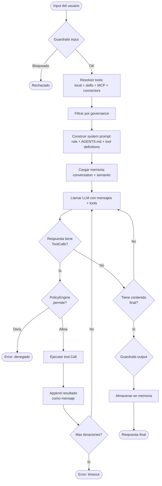

# Agent Loop (ReAct)

<!--
Copyright 2026 © The Kairos Authors
SPDX-License-Identifier: Apache-2.0
-->

Kairos soporta un bucle ReAct (Reasoning + Acting): el agente razona, ejecuta
herramientas y construye una respuesta final en varios turnos.

## Flujo del bucle ReAct



## Fases del ciclo

### 1. Preparacion

Antes del primer turno LLM, el agente:

- Genera un `RunID` unico y abre un span OTEL.
- Ejecuta guardrails de input (prompt injection, content filter).
- Resuelve tools: tools locales + skills + MCP tools + connectors.
- Aplica el `ToolFilter` de governance para excluir tools no permitidos.
- Construye el system prompt con el rol, instrucciones de AGENTS.md y
  definiciones de tools.
- Carga contexto de memoria conversacional y semantica.

### 2. Iteracion LLM

En cada iteracion:

1. Se envia `ChatRequest` al `llm.Provider` con mensajes y tools.
2. Si el LLM responde con `ToolCalls`:
   - Cada tool call se evalua contra el `PolicyEngine`.
   - Si se aprueba, se ejecuta `tool.Call(ctx, input)`.
   - El resultado se agrega como mensaje de tool al historial.
   - Se continua con la siguiente iteracion.
3. Si el LLM responde con contenido final (sin tool calls):
   - Se aplican guardrails de output (PII filter, content filter).
   - Se almacena en memoria si esta configurada.
   - Se retorna la respuesta.

### 3. Limites

- `maxIterations` (por defecto 10): previene loops infinitos.
- Si se alcanza el limite, se retorna un error `CodeTimeout`.

## Ejemplo: ciclo con tool call

```
Usuario: "Cuanto es 10 + 5?"

Iteracion 1:
  LLM piensa: "Necesito usar la calculadora"
  LLM responde: ToolCall{name: "calculator", args: {"expression": "10+5"}}
  -> PolicyEngine: Allow
  -> calculator.Call(ctx, {"expression": "10+5"}) = "15"
  -> Append: {role: "tool", content: "15"}

Iteracion 2:
  LLM recibe el resultado de la tool
  LLM responde: "El resultado de 10 + 5 es 15"
  -> Guardrails output: OK
  -> Retorna: "El resultado de 10 + 5 es 15"
```

## Modo planner (alternativo)

Cuando se configura `agent.WithPlanner(graph)`, el agente NO ejecuta el bucle
ReAct. En su lugar ejecuta un grafo DAG explicito. Ver
[Conceptos_Planner.md](Conceptos_Planner.md) para detalles.

## Codigo

```go
a, _ := agent.New("demo", llmProvider,
    agent.WithRole("Analista"),
    agent.WithTools([]core.Tool{calculatorTool}),
    agent.WithMCPClients(mcpClient),
)

result, _ := a.Run(ctx, "Cuanto es 10 + 5?")
```

## Configuracion del loop

| Opcion | Descripcion |
|--------|-------------|
| `agent.WithDisableActionFallback(true)` | Desactiva parsing legacy "Action:" |
| `agent.WithActionFallbackWarning(true)` | Emite warning si se usa fallback |
| `agent.WithGuardrails(g)` | Integra filtros de seguridad |
| `agent.WithPolicyEngine(pe)` | Enforcement de politicas en tool calls |
| `agent.WithEventEmitter(e)` | Emite eventos semanticos por iteracion |

## Ver tambien

- [Arquitectura](ARCHITECTURE.md) — diagrama completo del sistema
- [API Reference](API.md) — opciones del agente
- [Ejemplo 01: Hello Agent](../examples/01-hello-agent/README.md) — agente minimo
- [Ejemplo 09: Error Handling](../examples/09-error-handling/README.md) — manejo de errores en el loop
