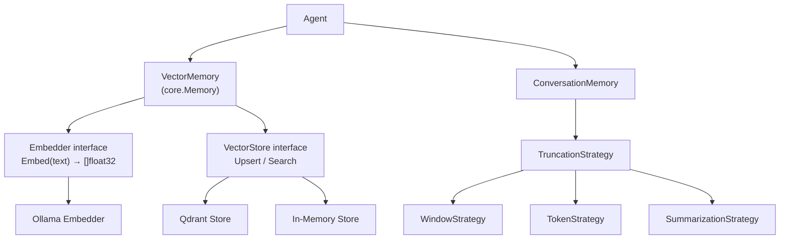

# Memoria

<!--
Copyright 2026 © The Kairos Authors
SPDX-License-Identifier: Apache-2.0
-->

Kairos tiene dos sistemas de memoria complementarios: **memoria semantica**
(vector) para recuperar contexto relevante y **memoria conversacional** para
mantener el historial de chat.

## Arquitectura



## Memoria semantica (Vector)

Almacena hechos como embeddings vectoriales y los recupera por similitud.

### Componentes

| Componente | Interface | Implementaciones |
|------------|-----------|-----------------|
| VectorStore | `Upsert`, `Search`, `CreateCollection` | Qdrant, In-Memory |
| Embedder | `Embed(ctx, text) → []float32` | Ollama |
| VectorMemory | `core.Memory` (`Store`, `Retrieve`) | Manager que orquesta VectorStore + Embedder |

### Uso

```go
// Crear store y embedder
store, _ := qdrant.New("localhost:6334")
embedder := ollama.NewEmbedder("http://localhost:11434", "nomic-embed-text")

// Crear VectorMemory
mem, _ := memory.NewVectorMemory(ctx, store, embedder, "kairos")
_ = mem.Initialize(ctx)

// Almacenar hechos
_ = mem.Store(ctx, "Mi color favorito es azul.")
_ = mem.Store(ctx, "Trabajo como ingeniero de software.")

// Recuperar por similitud
matches, _ := mem.Retrieve(ctx, "color favorito")
// → ["Mi color favorito es azul."]
```

### Integracion con el agente

El agente consulta la memoria antes de cada llamada LLM y agrega el contexto
relevante al prompt:

```go
a, _ := agent.New("demo", llmProvider,
    agent.WithMemory(mem),
)
```

### Degradacion

Si el backend de vectores no esta disponible, `VectorMemory` puede degradar
a modo sin memoria (log warning, continua sin contexto).

## Memoria conversacional

Mantiene el historial de mensajes de una conversacion multi-turno.

### Backends

| Backend | Constructor | Uso |
|---------|------------|-----|
| In-Memory | `memory.NewInMemoryConversation(cfg)` | Desarrollo y testing |
| File | `memory.NewFileConversation(cfg)` | Persistencia local |
| PostgreSQL | `memory.NewPostgresConversation(cfg)` | Produccion distribuida |

### Estrategias de truncado

Cuando la conversacion crece, se trunca automaticamente:

| Estrategia | Constructor | Comportamiento |
|------------|------------|---------------|
| Window | `memory.NewWindowStrategy(n, keepSystem)` | Mantiene ultimos N mensajes |
| Token | `memory.NewTokenStrategy(n, keepSystem)` | Mantiene hasta N tokens |
| Summarization | `memory.NewSummarizationStrategy(...)` | Resume mensajes antiguos via LLM |

### Uso

```go
// Crear memoria conversacional
convMem := memory.NewInMemoryConversation(memory.ConversationConfig{
    TruncationStrategy: memory.NewWindowStrategy(20, true),
})

// Integrar con el agente
a, _ := agent.New("chat", llmProvider,
    agent.WithConversationMemory(convMem),
)

// Cada sesion mantiene su historial
ctx := core.WithSessionID(context.Background(), "user-123")
a.Run(ctx, "Me llamo Juan")
a.Run(ctx, "Como me llamo?")  // Recuerda "Juan"
```

## Uso combinado

Ambos sistemas se pueden usar simultaneamente:

```go
a, _ := agent.New("agent", llmProvider,
    agent.WithConversationMemory(convMem),  // Historial de chat
    agent.WithMemory(vectorMem),            // Conocimiento semantico
)
```

- **Conversacional**: recuerda el flujo de la conversacion actual.
- **Semantica**: recupera conocimiento previo relevante al prompt actual.

## Ver tambien

- [API Reference — Memory](API.md#memory) — constructores y opciones
- [CONVERSATION_MEMORY.md](CONVERSATION_MEMORY.md) — guia completa de memoria conversacional
- [Ejemplo 03: Memory Agent](../examples/03-memory-agent/README.md) — memoria semantica
- [Ejemplo 20: Conversation Memory](../examples/20-conversation-memory/README.md) — memoria conversacional
