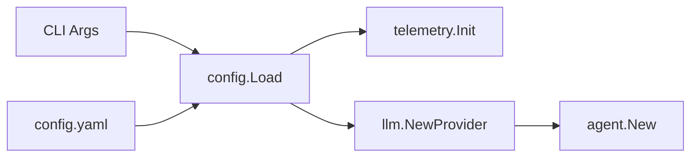

# Playbook 02 - Professional Setup

Goal: load config, init telemetry, and run the agent through the runtime.

## Why this step?

Building a prototype is easy; building a production-ready system is hard. Kairos provides built-in support for configuration management and OpenTelemetry observation from the start. This ensures that as SkyGuide grows, you can always debug its thoughts and actions.

## SkyGuide Narrative

SkyGuide needs to be reliable. We are adding a "telemetry" system so we can see every interaction. We also want to be able to swap our "brain" (LLM) easily using a configuration file, moving away from hardcoded mock providers.

## The Flow



## Incremental reuse

- Create shared helpers in `examples/playbook/shared` (config, providers, observability, agent).
  - See [shared/config](file:///Users/jllopis/src/kairos/examples/playbook/shared/config/README.md)
  - See [shared/providers](file:///Users/jllopis/src/kairos/examples/playbook/shared/providers/README.md)
  - See [shared/observability](file:///Users/jllopis/src/kairos/examples/playbook/shared/observability/README.md)
  - See [shared/agent](file:///Users/jllopis/src/kairos/examples/playbook/shared/agent/README.md)

## What to implement

- Parse config with `config.LoadWithCLI`.
- Init telemetry with `telemetry.InitWithConfig`.
- Pick provider based on `cfg.LLM.Provider` (mock, ollama, openai, gemini).
- Build agent with config overrides:
  - `agent.WithDisableActionFallback`
  - `agent.WithActionFallbackWarning`
- Run through `runtime.NewLocal()` and `runtime.Run` (the recommended entrypoint).
## Execution

### Using a configuration file
The recommended way to run this step is using the provided `config.yaml`:
```bash
go run . --config config.yaml
```

### Using environment variables
Kairos automatically loads variables with the `KAIROS_` prefix:
```bash
export KAIROS_LLM_PROVIDER=gemini
export KAIROS_LLM_MODEL=gemini-3-flash-preview
go run .
```

### Direct CLI overrides
```bash
go run . --set llm.provider=gemini --set llm.model=gemini-3-flash-preview
```

### Telemetry
To see traces in the console, ensure `telemetry.exporter` is `stdout` (set in `config.yaml`) or use:
```bash
KAIROS_TELEMETRY_EXPORTER=stdout go run .
```

## Manual tests

- "Explain SkyGuide's mission in one sentence."

## Expected behavior

- Provider selection follows config.
- Telemetry initializes and emits traces to stdout.

## Checklist

- [x] Config loading works with CLI overrides.
- [x] Telemetry shutdown runs cleanly.
- [x] Provider selection supports mock and gemini.

## References

- [02-basic-agent](file:///Users/jllopis/src/kairos/examples/02-basic-agent)
- `pkg/config`
- `pkg/telemetry`
- `pkg/runtime`
