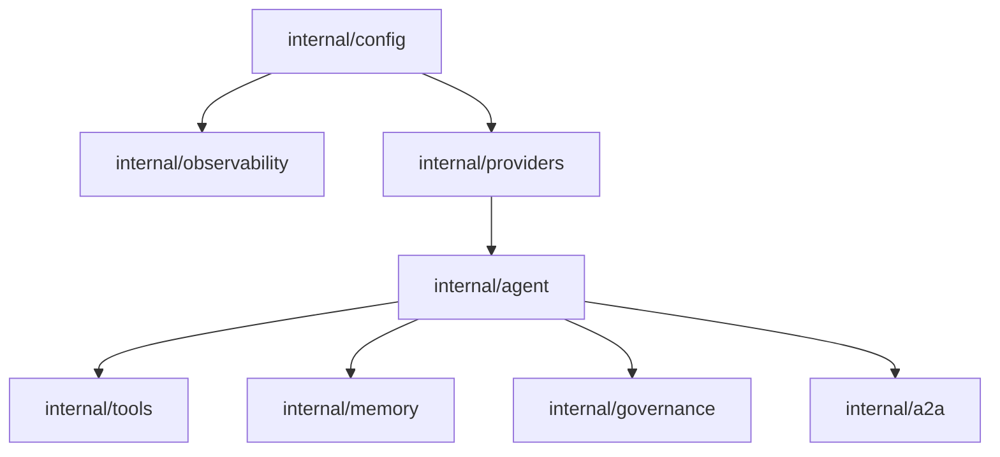

# Playbook internal packages

Goal: shared building blocks reused by every step so the playbook is incremental.
This is guidance only; you will write the code.

## The Architecture

The playbook uses an incremental approach. You build the foundation in Step 02 and expand it as needed.

## Contract First

As you build these, try to define clear Go signatures. This makes it easier to swap implementations (e.g., moving from In-Memory to Postgres).

### Recommended interfaces & types

- **Config**: Should return the `config.Config` from the core package.
- **Provider**: A factory that returns `llm.Provider` based on the config.
- **Agent**: A builder pattern that returns a `*agent.Agent` with all wired dependencies.

## Incremental mapping by step

- **Step 02**: Seed `config`, `observability`, `providers`, `agent`.
- **Step 03**: Add `tools`.
- **Step 04**: Add `skills`.
- **Step 05**: Add `memory`.
- **Step 06**: Add `mcp`.
- **Step 07**: Add `planner`.
- **Step 08**: Add `connectors`.
- **Step 09**: Add `governance`.
- **Step 10**: Add `guardrails`.
- **Step 11**: Add `resilience`.
- **Step 12**: Extend `observability`.
- **Step 13**: Extend `providers` for streaming.
- **Step 14**: Add `a2a` and `discovery` helpers.
- **Step 15**: Add `testing` helpers.
- **Step 16**: Add `http` and `store` (DB).
